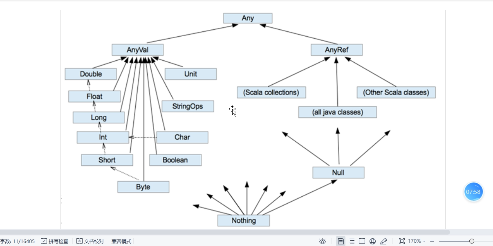

# Scala

## 1.变量

var  变量名: 变量类型 = 值      是可变变量

val  变量名 : 变量类型 = 值    是不可变变量

+ 如果类型可以通过变量值**推断**出来的话可以省略
+ 如果使用多态，那么类型将不能省略

## 2.标识符

Scala中的标识符可以用于声明运算符

不用记，错了改就行

## 3.字符串

字符串的拼接

   1.+    和Java中的字符串相加是一样的

2. 传值字符串  利用%s 占位符

   ```scala
   val name:String = "zhangsan"
   val passwd:String = "123123"
   
   printf("username":%s , name)
   printf("passwd":%s , passwd)
   ```

   3.插值字符串    在前面加个s   然后后面$符号 

   ```scala
   val name:String = "zhangsan"
   val passwd:String = "123123"   
   //插值字符串
   println(s"username:$name")
   ```

多行字符串  

+ 就是加三个"""abc"""  引号

```scala
val name:String = "zhangsan"
val passwd:String = "123123" 
    val  s =
      """
        | Hello
        | world
        |""".stripMargin
    println(s)

    val json =
      s"""
        |{"username":"$name","passwd":"$passwd"}
        |""".stripMargin

    print(json)
```


## 4.输入输出

1.输入

```scala
    // read - 控制台
    val str = StdIn.readLine()
    println(str)


    // 从文件中获取输入
    //数据源
    val source:BufferedSource = Source.fromFile("data/word.txt")
    val strings:Iterator[String] = source.getLines()
    while  (strings.hasNext){
      println(strings.next())
    }
```

2.输出

```scala
    val writer = new PrintWriter(new File("output/test.txt"))
    writer.write("Hello Scala")
    writer.close()

```


## 5.分布式计算

## 6.数据类型

Scala是完全面向对象的语言，所以不存在基本数据类型的概念，任意值对象类型（AnyVal）和任意引用对象类型(AnyRef)

AnyVal : 相当于Java中的基本数据类型   多了一个Unit  是无返回值类型 

AnyRef: Sring   Scala collections    all java classes    Other Scala classes

+ Null  是java classes的子类  Null    他是一个类型  只有一个对象就是null
+ Nothing  是Null的子类    就是在处理返回值类型的时候，统一处理正常返回和异常返回

 

类型转换

```scala
自动类型转化（隐式转换）
object ScalaDataType {
    def main(args: Array[String]): Unit = {
        val b : Byte = 10
        val s : Short = b
        val i : Int = s
        val lon : Long = i
}
}


强制类型转化

var a : Int = 10
Var b : Byte = a.toByte
// 基本上Scala的AnyVal类型之间都提供了相应转换的方法。 
```

## 7.运算符

scala中的语法双等号就是比较对象的内容，但是和equals不完全一样     前置进行非空判断

 user.tostring()   可以携程user tostring()  就是万物皆对象，   点可以省略

## 8.流程控制

单分支      if else  java一样

多分支      if   else    if      和java也一样

```scala
// todo 表达式的返回结果为：表达中满足条件的最后一行代码 的执行结果

    val age = 30
    // todo 表达式的返回结果为：表达中满足条件的最后一行代码 的执行结果
    val result = if  (age == 30) {
      println("30")
      "zhangsan"
    }


    println(result)


-->       "zhangsan"

```

for 循环

for ( 循环变量 <- 数据集 ) {

​    循环体

}

```scala
for (元素 : 元素类型  <-  1 to 5   把每个元素遍历出来)
for (i : Int <- 1 to 5){
      println(i)
    }


元素类型Int  可以省略
val range = 1 to 5
for (i <- range){
    println(i)
}
```

```scala
object ScalaLoop {
    def main(args: Array[String]): Unit = {
        for ( i <- Range(1,5) ) { // 范围集合
            println("i = " + i )
        }
        for ( i <- 1 to 5 ) { // 包含5
            println("i = " + i )
        }
        for ( i <- 1 until 5 ) { // 不包含5
            println("i = " + i )
        }
    }
}
```

**2)** **循环守卫**

```scala
循环时可以增加条件来决定是否继续循环体的执行,这里的判断条件我们称之为循环守卫

object ScalaLoop {

​    def main(args: Array[String]): Unit = {

​        for ( i <- Range(1,5) if i != 3  ) {

​            println("i = " + i )

​        }

​    }

}
```

​	**3)** **循环步长**

```scala
scala的集合也可以设定循环的增长幅度，也就是所谓的步长step
object ScalaLoop {
    def main(args: Array[String]): Unit = {
        for ( i <- Range(1,5,2) ) {
            println("i = " + i )
        }
        for ( i <- 1 to 5 by 2 ) {
            println("i = " + i )
        }
    }
}
```

4)**循环嵌套**

```scala
object ScalaLoop {
    def main(args: Array[String]): Unit = {
        for ( i <- Range(1,5); j <- Range(1,4) ) {
            println("i = " + i + ",j = " + j )
        }
        for ( i <- Range(1,5) ) {
            for ( j <- Range(1,4) ) {
                println("i = " + i + ",j = " + j )
            }
        }
    }
}
```

5) **引入变量**

```scala
object ScalaLoop {
    def main(args: Array[String]): Unit = {
        for ( i <- Range(1,5); j = i - 1 ) {
            println("j = " + j )
        }
    }
}
```

**6)** **循环****返回值**

```scala
scala所有的表达式都是有返回值的。但是这里的返回值并不一定都是有值的哟。

如果希望for循环表达式的返回值有具体的值，需要使用关键字yield

object ScalaLoop {

​    def main(args: Array[String]): Unit = {

​        val result = for ( i <- Range(1,5) ) yield {

​            i * 2

​        }

​        println(result)

​    }

}
```

while循环

和Java的while循环一样


break 循环中断

```scala
scala是完全面向对象的语言，所以无法使用break，continue关键字这样的方式来中断，或继续循环逻辑，而是采用了函数式编程的方式代替了循环语法中的break和continue

object ScalaLoop {

​    def main(args: Array[String]): Unit = {

​        scala.util.control.Breaks.breakable {

​            for ( i <- 1 to 5 ) {

​                if ( i == 3 ) {

​                    scala.util.control.Breaks.break

​                }

​                println(i)

​            }

​        }

​    }

}
```


## 9.函数式编程

 函数式编程

将问题分解成一个一个的步骤，将每个步骤进行封装（函数），通过调用这些封装好的功能按照指定的步骤，解决问题。

```scala
[修饰符] def 函数名 ( 参数列表 ) [:返回值类型] = {
    函数体
}

private def test( s : String ) : Unit = {
    println(s)
}
```

类中声明的函数称之为方法，其他场合声明的就是函数了

**函数的声明和调用**

```scala
object Scala02_Function_Def {

  def main(args: Array[String]): Unit = {
    // TODO 函数时编程
    //TODO 1. 无参，无返回值
    def fun1(): Unit ={
      println("fun1...")
    }
    fun1()
    //如果函数声明时。没有参数，那么在调用的时候可以省略小括号
    fun1
    //TODO 2. 无参，有返回值
    def fun2(): String ={
      return "zhangsan"
    }
    val s = fun2
    println(s)
    //TODO 3. 有参，无返回值
    def fun3(name : String): Unit ={
      val s = s"name:" +{name}
      println(s)
    }

    fun3("xiaoli")
    //TODO 4. 有参，有返回值
    def fun4(name : String): String ={
      return "Name : " + name
    }

    val xiaodong = fun4("xiaodong")
    println(xiaodong)

    //TODO 5. 多参，无返回值
    def fun5(name:String,age:Int): Unit ={
      println(s"Nmae: ${name}, Age : ${age}")
    }


    fun5("dongchao",18)
    //TODO 6. 有参，有返回值
    def fun6(name:String,age:Int): String ={
     return s"Nmae: ${name}, Age : ${age}"
    }

    val lili = fun6("lili",15)
    print(lili )
  }
}
 
```

```scala
1)可变参数
object ScalaFunction {
    def main(args: Array[String]): Unit = {
        def fun7(names:String*): Unit = {
            println(names)
        }
        fun7()
        fun7( "zhangsan" )
        fun7( "zhangsan", "lisi" )
    }
}
可变参数不能放置在参数列表的前面，一般放置在参数列表的最后
oobject ScalaFunction {
    def main(args: Array[String]): Unit = {
        // Error
        //def fun77(names:String*, name:String): Unit = {
            
        //}
        def fun777( name:String, names:String* ): Unit = {
            println( name )
            println( names )
        }
    }
}
2)参数默认值
object ScalaFunction {
    def main(args: Array[String]): Unit = {
        def fun8( name:String, password:String = "000000" ): Unit = {
            println( name + "," + password )
        }
        fun8("zhangsan", "123123")
        fun8("zhangsan")
    }
}
3)带名参数
object ScalaFunction {
    def main(args: Array[String]): Unit = {
        def fun9( password:String = "000000", name:String ): Unit = {
            println( name + "," + password )
        }
        fun9("123123", "zhangsan" )
        fun9(name="zhangsan")
    }
}
```

**函数至简原则**

```scala
1)省略return关键字
// 函数体会将满足条件最后一行代码的执行结果作为函数的返回值 
object ScalaFunction {
    def main(args: Array[String]): Unit = {
        def fun1(): String = {
            return "zhangsan"
        }
        def fun11(): String = {
            "zhangsan"
        }
    }
}
```

```scala
2)省略返回值类型
// 如果 函数返回数据， 那么可以推断出返回值类型的华，返回值类型就可以省略 
object ScalaFunction {
    def main(args: Array[String]): Unit = {
        def fun3() = {
            "zhangsan"
                     }
    }
}
```

```scala
3)省略花括号
// 如果函数体的逻辑代码只有一行的时候，  那么大括号可以省略
object ScalaFunction {
    def main(args: Array[String]): Unit = {
        def fun2()=  "zhangsan"    }
}
```


```scala
4)省略等号
如果函数体中有明确的return语句，那么返回值类型不能省略
object ScalaFunction {
    def main(args: Array[String]): Unit = {
        def fun5(): String = {
            return "zhangsan"
        }
        println(fun5())
    }
}
如果函数体返回值类型明确为Unit, 那么函数体中即使有return关键字也不起作用 
object ScalaFunction {
    def main(args: Array[String]): Unit = {
        def fun5(): Unit = {
            return "zhangsan"
        }
        println(fun5())
    }
}
如果函数体返回值类型声明为Unit, 但是又想省略，那么此时就必须连同等号一起省略
object ScalaFunction {
    def main(args: Array[String]): Unit = {
        def fun5() {
            return "zhangsan"
        }
        println(fun5())
    }
}
```


```scala
5)省略参数列表
object ScalaFunction {
    def main(args: Array[String]): Unit = {
        def fun4 = "zhangsan"
        fun4// OK
        fun4()//(ERROR)
    }
}
```

```scala
6)省略名称和关键字
object ScalaFunction {
    def main(args: Array[String]): Unit = {
        // 匿名函数
        () => {
            println("zhangsan")
        }
    }
}
```

### 下划线的作用

1.声明变量， 但是不能访问

​	val _ = "zhangsan"

2. 将函数作为整体使用

   如果将函数作为整体去使用，而不是执行结果赋值给变量，那么需要采用特殊符号:   下划线 

   val f2 = fun2 _ 

   3. 使用import 语法时，下划线可以代替Java中的*

      import java.util._

    4. 如果变量声明的类型为函数类型，那么可以不适用下划线来让函数作为对象

函数的另外一种写法：  ( 输入参数类型 ) => 输出类型

```scala
def test1 (name:String,age : Int) : String = {
    "123"
}
val ff:(String,Int) =>String = test1
```

函数作为值

```scala
object ScalaFunction {
    def main(args: Array[String]): Unit = {
        def fun1(): String = {
            "zhangsan"
        }
        val a = fun1
        val b = fun1 _
        val c : ()=>Unit = fun1
        println(a)
        println(b)
    }
}
```

### **下划线省略到最简**

 匿名函数在使用的时候也可以遵循至简原则

//1. 如果函数体的逻辑代码只有一行，大括号可以省略， 代码卸载一行中

// 2. 如果参数的类型可以推断出来，那么参数类型可以省略  

 // 3. 如果参数只有一个的话，参数列表的小括号可以省略
 // 4. 如果参数在使用时，按照顺序只使用了一次，那么可以使用下划线代替参数，

```scala

object Scala06_Function_Hell_1 {

    def main(args: Array[String]): Unit = {

        // TODO 函数式编程 - 地狱版
        /*
            public void test( User user ) {
            public void test( 函数类型 参数名称 ) {

            }

         */
        // TODO 2. 将函数作为参数来使用
//        def test(  f : ()=>Unit ): Unit = {
//            f()
//        }
//
//        // 函数对象
//        def fun1(): Unit = {
//            println("xxxxxxx")
//        }
//
//        val ff = fun1 _
//
//        test( ff )
        def test( f : (Int, Int) => Int ): Unit = {
            val r = f(10, 20)
            println(r)
        }
//
//        def fun2(x:Int, y:Int): Int = {
//            x + y
//        }
//        def fun3(x:Int, y:Int): Int = {
//            x - y
//        }
//        def fun4(x:Int, y:Int): Int = {
//            x * y
//        }
//
//        def fun5(x:Int, y:Int): Int = {
//            x + y
//        }

        //test(fun2)
        //test(fun3)
        //test(fun4)

        // TODO 匿名函数主要应用于函数作为参数使用
//        test(
//            (x:Int, y:Int) => {
//                x - y
//            }
//        )
        // TODO 匿名函数在使用时也可以存在至简原则
        // 1. 如果函数体的逻辑代码只有一行，大括号可以省略，代码写在一行中
//        test(
//            (x:Int, y:Int) => x - y
//        )
        // 2. 如果参数的类型可以推断出来，那么参数类型可以省略的
//        test(
//            (x, y) => x - y
//        )
        // 3. 如果参数只有一个的话，参数列表的小括号可以省略
        // 4. 如果参数在使用时，按照顺序只使用了一次，那么可以使用下划线代替参数，
        //test(_ * _)
    }
}
```

### 函数作为返回值使用

```scala

object Scala06_Function_Hell_6 {

    def main(args: Array[String]): Unit = {

        // TODO 函数式编程 - 地狱版
        // TODO 3. 将函数作为返回值返回
        /*
           public User getUser() {
              return new User();
           }
         */
        def test(): Unit = {
            println("function...")
        }

        def fun() = {
            test _
        }

        //val f = fun _
        //val ff = f()
        //ff()

        fun()()

        test()

    }
}

```

### 闭包

一个函数使用了外部的变量，把这个变量包含到了内部来使用，改变了这个变量的声明周期，

将当前的代码形成了一个闭合的环境，这个环境称之为闭包环境，简称闭包

```scala
object Scala06_Function_Hell_8 {

    def main(args: Array[String]): Unit = {

        // TODO 函数式编程 - 地狱版
        // TODO 3. 将函数作为返回值返回, 一般应用于将内部的函数在外部使用

        // TODO 闭包
        // 一个函数使用了外部的变量，把这个变量包含到了它的内部来使用，改变了这个变量的生命周期
        // 将当前的代码形成了一个闭合的环境，这个环境称之为闭包环境，简称为闭包

        // Scala2.12版本前闭包功能采用的是匿名函数类型实现
        // Scala2.12版本闭包功能采用的是更改函数声明实现

        def outer( a : Int ) = {
            def inner( b : Int ): Int = {
                a + b
            }
            inner _
        }

        //println(outer(10)(20))
        val f = outer(10)
        val ff = f(20)

        println(ff)

    }
}
```

### 控制抽象

 ```scala
 // TODO : 控制抽象
        // 抽象
        // 函数类型：() =>Unit
        def myWhile(op: => Boolean) = {
            op
        }

        // 参数类型不完整，那么在传递参数时，也是不完整：只有传递代码就可以，不需要完整的声明
        // 可以采用控制抽象设计语法
        Breaks.breakable {
            for ( i <- 1 to 5 ) {
                Breaks.break()
            }
        }

//        val age = 10
//        myWhile( age < 20 ) {
//            println("xxx")
//        }
//
//
//        while( age < 20 ) {
//            println("xxx")
//        }
 ```

### 柯里化

```scala
 // TODO 函数式编程 - 柯里化（Curry）

        // 将无关的参数分离开
        def test( a:Int, b:Int ): Unit = {
            for ( i <- 1 to a ) { // 10min
                println(i)
            }
            for ( j <- 1 to b ) { // 20min
                println(j)
            }
        }

        def test1(a:Int)(b:Int): Unit = {
            for ( i <- 1 to a ) { // 10min
                println(i)
            }
            for ( j <- 1 to b ) { // 20min
                println(j)
            }
        }

        val a = 10 // 10min
        val b = 20 // 20min
        test(a, b) // 60min
        test1(a)(b)
```

###  **惰性函数**

```scala
当函数返回值被声明为lazy时，函数的执行将被推迟，直到我们首次对此取值，该函数才会执行。这种函数我们称之为惰性函数。

object ScalaFunction {

​    def main(args: Array[String]): Unit = {

​        def fun9(): String = {

​            println("function...")

​            "zhangsan"

​        }

​        lazy val a = fun9()

​        println("----------")

​        println(a)

​    }

}
```

## 10.面向对象编程

### 包

```scala
package com
package atguigu
package bigdata
package scala {
    class Test {
        def test(): Unit = {
            println("test...")
        }
    }
    package chapter06 {
        object Scala02_Object_Package {

            def main(args: Array[String]): Unit = {

                // TODO  - 面向对象编程 - 包
                /*
                   TODO java package :
                   1. 分类管理 util.StringUtil, DateUtil
                      Lock, aaa.KafkaProducer
                   2. 区分类 java.util.UtilDate, java.sql.SQLDate
                   3. 包访问权限 （X）

                   SpringBoot => c.a.b.c.d.XXXXX

                   TODO scala
                   发现package语法过于简单，但是又不能省略。
                   马丁说：我要赋予它更多的功能
                   1. 可以让源码文件中多次使用package关键字
                   2. 源码物理路径和包名没有关系
                   3. 明确包的作用域，可以在package关键字的后面增加大括号
                   4. 同一个源码中，子包中可以直接访问父包中的内容
                   5. scaka可以将包当成对象来用
                      可以直接声明属性和方法

                 */
                //new Test().test()
                testPackageObject()

            }
        }
    }
}


```

### 导入

import

```scala
package com.atguigu.bigdata.scala.chapter06


object Scala03_Object_Import {

    def main(args: Array[String]): Unit = {

        // TODO  - 面向对象编程 - 导入
        /*

         TODO java import :
          1. 导入其他包中的类
          2. 静态导入

          scala import :
          java中的import功能比较单一，但是不能省略
          马丁想：赋予import更多的功能
         */
        // TODO 1. 星号在scala中有特殊用于，所以不能使用在import语法中,需要采用特殊符号：下划线
        //import java.util._
        // TODO 2. import关键字可以在任何地方使用
        //import java.util.Date
        //new Date()
        // TODO 3. 可以在一行中导入同一个包中多个类
        //import java.util.{ArrayList, List, LinkedList}
        //new ArrayList()
        // TODO 4. 导包
        //import java.util
        //new util.ArrayList()

        // TODO 5. 隐藏类
        //import java.util._
        //import java.sql.{Date=>_, _}
        //new Date()
        //new ArrayList();
        //new Timestamp(111)

        // TODO 6. scala中导入类的操作，是以相对路径（当前包路径）的方式导入的。
        //         如果想要使用绝对路径的方式，那么需要增加特殊操作:_root_
        println(new _root_.java.util.HashMap())
        // { k = v, k =v }
        // [a, b, c, d]

        // TODO 7. 给类起别名
        import java.util.{HashMap=>JavaHashMap}
        println(new JavaHashMap())


    }
}
//package java {
//    package util {
//        class HashMap {
//
//        }
//    }
//}

```

### 类

```scala
面向对象编程中类可以看成一个模板，而对象可以看成是根据模板所创建的具体事物
1)基本语法
// 声明类：访问权限 class 类名 { 类主体内容 } 
class User {
    // 类的主体内容
}
// 对象：new 类名(参数列表)
new User()
2)扩展语法
Scala中一个源文件中可以声明多个公共类
```

### 属性

```scala
object Scala05_Object_Field {

    def main(args: Array[String]): Unit = {

        // TODO 面向对象 - 类 - 属性
        // 所谓的属性，其实就是类中的变量
        // 在编译时，编译器会将变量编译为类的（私有的）属性，同时提供了属性对应的set，get方法
        val test = new Test()
        // 给类的属性赋值，等同于调用对象属性的set方法
        //test.name = "lisi"
        // 访问类的属性时，等同于调用对象属性的get方法
        //println(test.name)

        // 使用 val声明的类的变量，取值不能修改
        // val声明的属性，在编译时，会给属性添加final关键字，编译器不会提供属性的set方法
        // test.age = 20

        // scala中变量必须显示地初始化
        // 如果希望类的属性和java一样可以由系统进行初始化，而是手动赋值，可以采用特殊符号：下划线

        // java bean规范
        // 反射一般用于架构设计，而架构设计的目的就是通用化
        // scala中给属性提供的set，get方法不遵循bean规范
        // sql => cols => [id ,name, age] => getId, getName, getAge

        test.setEmail("xxx")
        test.getEmail()

    }
    class Test {
        // 声明属性
        // private String name = "zhangsan";
        // private final int age = 30;
        private var name : String = "zhangsan"
        val age : Int = 30
        @BeanProperty var email : String = _
    }
}
```

### 访问权限

```scala
访问权限
Scala中的访问权限和Java中的访问权限类似，但是又有区别：
private : 私有访问权限
private[包名]: 包访问权限
protected : 受保护权限，不能同包
            : 公共访问权限
```


### 方法 

```scala
Scala中的类的方法其实就是函数，所以声明方式完全一样，但是必须通过使用对象进行调用
object ScalaMethod{
    def main(args: Array[String]): Unit = {
        val user = new User
        user.login("zhangsan", "000000")
    }
}
class User {
    def login( name:String, password:String ): Boolean = {
        false
    }
}
```

### 对象

```scala
Scala中的对象和Java是类似的
val | var 对象名 [：类型]  = new 类型()
var user : User = new User()
```


### 构造方法

```scala
object Scala09_Object_Instance {

    def main(args: Array[String]): Unit = {

        // Java中的构造方法
        // 1. 提供无参，公共的构造方法
        // 2. 构造方法可以重载的
        // 3. 构造方法可以互相调用
        // 4. 必须显示调用父类有参的构造方法
        // 5. 构造方法的名称应该和类型一致。

        // Scala中的构造方法
        // 1. 提供无参，公共的构造方法
        // 2. scala中构造方法的名称和类名是不一致的。

        // scala是一个完全面向对象的语言，又是一个完全面向函数的语言。
        // 所以类也是一个函数：声明一个类就等同于声明一个函数
        // 类名的后面可以声明小括号，表示构造参数列表
        val user = new User()


    }
    class User() {
        // 类的初始化
        // 构造方法体 & 类的主体内容
        val name : String = "zhangsan"
        def test(): Unit = {

        }
        println("user...")
    }
}
```

```scala
和Java一样，Scala中构造对象也需要调用类的构造方法来创建。并且一个类中可以有任意多个不相同的构造方法。这些构造方法可以分为2大类：主构造函数和辅助构造函数。
class User() { // 主构造函数
    var username : String = _ 
    def this( name:String ) { // 辅助构造函数，使用this关键字声明
        this() // 辅助构造函数应该直接或间接调用主构造函数
        username = name
}
def this( name:String, password:String ) {
    this(name) // 构造器调用其他另外的构造器，要求被调用构造器必须提前声明
}
}
```

### 伴生对象和伴生类

```scala

object Scala09_Object_Instance_4 {

    def main(args: Array[String]): Unit = {

        // 构造方法私有化: 在参数列表前增加private关键字
        // 声明一个公共的，静态的，返回本类型的方法，用于获取对象
        // scala中没有静态语法,但是可以直接使用java中的静态操作
        // scala采用了一种特殊的处理方式来代替静态语法 ：object
        // object关键字可以用于创建对象，对象的名字就是声明的名字

        // 使用object关键字声明的类和对象有关系的。
        // 这个对象等同于伴随着这个类创建时所产生的，所以将这个对象称之为：伴生对象
        // 这个类称之为伴生类
        // 伴生对象就是一个对象，可以访问伴生类中的所有东西，包括私有的。
        // 伴生对象其实就是马丁模拟静态语法所产生的。
        // 一般写代码时，将静态语法操作的代码写在伴生对象中，将成员方法或属性写在伴生类中


        //val p = new Person()
        //p.getInstance();
//        val person: Person = Person.getInstance()
//        println(person)
        new ScalaUser().name
        ScalaUser.email


    }
    // 伴生类
    class Person private () {

    }
    // 伴生对象
    // Person.class
    // Person$.class
    object Person {
        def getInstance() : Person = {
            new Person()
        }
    }

}
```

```scala

object Scala09_Object_Instance_5 {

    def main(args: Array[String]): Unit = {

        // TODO scala中伴生对象就是单例的
        // 伴生对象只需要声明即可，无需构建，所以不需要构造参数列表
        // 单例模式存在一个问题：创建的对象不会被回收，需要显示地回收（设置为null）

        // 如果伴生对象中构建对象的方法名成为apply，编译器可以自动识别的，所以这个方法名可以省略的
        //val test1: Test = Test.apply()
        //val test1 = new Test() // 调用类的构造方法
        //val test2 = Test()     // 调用的是伴生对象的apply方法
        //val test3 = Test       // 伴生对象本体

        //println(test3)

        for ( i <- Range(1,2,2) ) {

        }


    }
    class Test() {
        println("ttttt")
    }
    object Test {
        def apply() = {
            println("apply")
            //new Test()
        }
    }
```

### 抽象

```scala

object Scala10_Object_Abstract {
  def main(args: Array[String]): Unit = {
    // TODO 面向对象 - 抽象
    // 所谓的抽象其实就是不完整
    // 抽象类，  抽象方法
    // 抽象类没有办法实例化,需要由子类继承后完成实例化操作
    // 子类继承抽象类之后，可以声明为抽象类，也可以将iang父类的抽象方法实现
    // Scala中不完整的方法就是抽象的。无需增加abstract关键字
    val user = new Child()
    user.test()
  }
  class Child extends User{
    override def test(): Unit = {
      println("childt.test...")
    }
  }

   abstract  class User {
    // 抽象方法：只有声明  没有实现
    def test():Unit
  }
}
```

```scala
package com.dcit.scala.chaptet06

class Scala10_Object_Abstract_1 {
  def main(args: Array[String]): Unit = {
    // TODO 面向对象- 抽象- 属性
    // Scala中的属性也可以是抽象的

  }

  abstract class User{
    // 抽象属性： 只有声明 没有初始化
    // 编译时，不会在类中声明属性，而是会声明属性的set   get  方法，并且是抽象的
    val name:String
  }
  class Child extends User{
    // 属性：编译时 会在类中声明私有属性，同时提供属性的set 和get方法 并且是公共的
    override val name: String = "zhangsan"
  }

}

```

```scala
object Scala10_Object_Abstract_2 {

    def main(args: Array[String]): Unit = {

        // TODO 面向对象 - 抽象

        // 子类重写父类的抽象方法，直接补充完整即可
        // 子类重写父类的完整方法，必须添加override关键字
        // 开发时，推荐，只要重写，都添加override


    }
    abstract class User {
        def test(): Unit = {

        }
        def fun():Unit
    }
    class Child extends User {
        override def test(): Unit = {

        }
        override def fun():Unit = {

        }
    }
}
```

```scala
object Scala10_Object_Abstract_3 {

    def main(args: Array[String]): Unit = {

        // TODO 面向对象 - 抽象

        // 子类可以重写父类的抽象属性，补充完整即可
        // 子类可以重写父类的完整属性，那么必须要添加override关键字
       // println(new Child().age)

        println(new Child().test)


    }
    abstract class User {
        var name : String
        val age : Int = 10

        def test(): Unit = {
            //age = 30 // 对属性的赋值其实等同于调用属性的set方法
            println(age) // 对属性的方法其实等同于调用属性的get方法
        }
    }
    class Child extends User {
        var name : String = "zhangsan" // 重写
        override val age : Int = 20
    }
}
```

### 特征

```scala
    // TODO 面向对象 - 特征
    // 将多个对象中相同的特征，从对象中剥离出来，形成独立的一个结构，称之为trait（特征）
    // 如果一个对象符合这个特征，那么可以将这个特征加入到这个对象，这个加入的过程，称之为混入(extends)

    // 如果一个类只有一个特征时，采用extends关键字进行混入
    // 但是一个类如果有多个特征，这个时候，第一个特征采用extends，后续采用with

    // 如果类存在父类的场合，并同时具备了某个特征，
    // 需要使用extends关键字继承父类，使用with关键字来混入特征
 trait eat {
        def eat():Unit
    }
    trait Runnable {
        def run():Unit
    }
    class Person extends Object with Runnable {
        override def run(): Unit = {
            println("run...")
        }
    }
    class Dog extends Runnable {
        override def run(): Unit = {
            println("run...")
        }
```
```scala
// 特征的动态混入
object Scala12_Object_Trait_1 {

    def main(args: Array[String]): Unit = {

        // TODO 面向对象 - 特征
        // 动态混入
        val user = new User() with Updateuser
        user.insertUser()
        user.updateUser()

    }
//    class Parent {
//                def updateUser(): Unit = {
//                    println("update user...")
//                }
//    }
    trait Updateuser {
        def updateUser(): Unit = {
            println("update user...")
        }
    }
    class User {
        def insertUser(): Unit = {
            println("insert user...")
        }
//        def updateUser(): Unit = {
//            println("update user...")
//        }
    }
}
```

```scala
object Scala12_Object_Trait_2 {

    def main(args: Array[String]): Unit = {

        // TODO 面向对象 - 特征(特质)
        // 可以将trait理解为接口和抽象类的结合体
        new User()

    }

    trait Test extends Exception {
        def test(): Unit
    }
    class Person{

    }
    class User extends Test {
        override def test(): Unit = {

        }
    }
}
```

        // 1. 初始化顺序问题
        //    父类的特质 > 父类 > 特质1, 特质2 > 当前类
```scala
特征  功能叠加
def main(args: Array[String]): Unit = {

        // TODO 面向对象 - 特征(特质)

        // java中不能类的多继承 ： 砖石问题
        // scala采用了一种功能叠加的方式解决砖石问题
        // super不是父特质的意思，是上一级（上一个）的意思
        new MySQL().operData()

    }
    trait Operator {
        def operData(): Unit = {
            println("操作数据")
        }
    }
    trait DB extends Operator{
        override def operData(): Unit = {
            print("向数据库中")
            super.operData()
        }
    }
    trait Log extends Operator {
        override def operData(): Unit = {
            print("向日志文件中")
            super[Operator].operData()
        }
    }
    class MySQL extends DB with Log {

    }
```

### 扩展

```scala
扩展
类型检查和转换
class Person{
}
object Person {
    def main(args: Array[String]): Unit = {

        val person = new Person

        //（1）判断对象是否为某个类型的实例
        val bool: Boolean = person.isInstanceOf[Person]

        if ( bool ) {
            //（2）将对象转换为某个类型的实例
            val p1: Person = person.asInstanceOf[Person]
            println(p1)
        }

        //（3）获取类的信息
        val pClass: Class[Person] = classOf[Person]
        println(pClass)
    }
}
思考一个问题: 字符串真的不可变吗？
枚举类和应用类
object Test {
    def main(args: Array[String]): Unit = {
        println(Color.RED)
    }
}

// 枚举类
object Color extends Enumeration {
    val RED = Value(1, "red")
    val YELLOW = Value(2, "yellow")
    val BLUE = Value(3, "blue")
}

// 应用类
object AppTest extends App {
    println("application");
}
Type定义新类型
使用type关键字可以定义新的数据数据类型名称，本质上就是类型的一个别名
object Test {
    def main(args: Array[String]): Unit = {
        type S = String
        var v : S = "abc"
    }
}
```

## 11.集合

### 数组

严格意义上 数组不是集合

 集合分为两大类：可变集合，不可变集合

 Scala默认提供的集合都是不可变。

```scala
   def main(args: Array[String]): Unit = {

        // TODO - 集合 - 数组
        // 集合分为两大类：可变集合，不可变集合
        // Scala默认提供的集合都是不可变。
//        val array = new Array[String](3)
//        array(0) = "a"
//        array(1) = "a"
//        array(2) = "a"
        // 使用集合的伴生对象构建集合，并同时初始化
        val array1 = Array(1,2,3,4)
        val array2 = Array(5,6,7,8)
        //val array2 = Array.apply(1,2,3,4)

        // 访问
        //val ints: Array[Int] = array1.+:(5)
        // scala中如果运算符是以冒号结尾，那么运算规则为从后向前计算
        val ints = 5 +: array1

        //val ints1: Array[Int] = array1.:+(5)
        val ints1 = array1 :+ 5

        val ints2 = array1 ++ array2
        val ints3 = array1 ++: array2

        //println(array1 eq ints)
        //println(array1 eq ints1)
       // println(ints eq ints1)


        // TODO 遍历
        //println(ints.mkString(","))
        //println(ints1.mkString(","))
        //println(ints2.mkString(","))

        // foreach方法是一个循环的方法，需要传递一个参数，这个从参数的类型是函数类型
        //  函数类型 ： Int => U
        def foreachFunction(num:Int): Unit = {
            println(num)
        }

        //array1.foreach(foreachFunction)
        //array1.foreach((num:Int)=>{println(num)})
        //array1.foreach((num:Int)=>println(num))
        //array1.foreach((num)=>println(num))
        //array1.foreach(num=>println(num))
        array1.foreach(println(_))
    }
}
```

```scala
object Scala02_Collection {

    def main(args: Array[String]): Unit = {

        // TODO - 集合 - 数组 - 可变数组
        //val buffer = new ArrayBuffer[String]()
        val buffer = ArrayBuffer("a", "b", "c")
        println(buffer)
        // TODO 操作
        //buffer.append("a", "b", "c", "d")
       // buffer.appendAll(Array("a", "b", "c"))
        //buffer.insert(100, "f")

        //buffer.update(0, "e")
        //buffer(0) = "e"

        //buffer.remove(2)
        //buffer.remove(2,2)

        val strings: ArrayBuffer[String] = buffer - "a"

        println(buffer eq strings)
        println(buffer)
        println(strings)


    }
}

```

### 常见方法

```scala
    def main(args: Array[String]): Unit = {

        // TODO - 集合 - 方法
        val array = Array(1,2,3,4)

        println(array.size)
        println(array.length)
        println(array.isEmpty)
        println(array.contains(2))
        println(array.distinct.mkString(","))
        println(array.reverse.mkString(","))

        println(array.mkString(","))
        array.foreach(println)
        array.iterator
        
        
        
        
        // TODO - 集合 - 方法
        val array = ArrayBuffer(1,2,3,4)

        // 从集合中获取部分数据
        println(array.head)
        println(array.tail)
        println(array.tails)
        println(array.last)
        println(array.init) // 初始
        println(array.inits)

        // 取前几个
        println(array.take(3))
        //println(array.reverse.take(2).reverse)
        println(array.takeRight(2))
        println(array.drop(1))
        println(array.dropRight(1))

```

```scala
object Scala03_Collection_2 {

    def main(args: Array[String]): Unit = {

        // TODO - 集合 - 方法
        val array = ArrayBuffer(1,2,3,4, 5)

        println(array.sum)
        println(array.max)
        println(array.min)
        println(array.product)

        // 自定义数据操作的方法
        // 集合的数据无论是多少，最基本的数据操作其实都是两两计算。
        // map => reduce => 简化，规约（聚合）

        def reduceFunction(x : Int, y : Int): Int = {
            x + y
        }

        //println(array.reduce(reduceFunction))
        //println(array.reduce((x:Int, y:Int)=>{x + y}))
        //println(array.reduce((x:Int, y:Int)=>x + y))
        //println(array.reduce((x, y)=>x + y))
        println(array.reduce(_ - _))  // -13
        println(array.reduceLeft(_ - _)) // -13

        // 【1，2，3，4】
        //  (((1 + 2) + 3) + 4)
        // reversed.reduceLeft[B]((x, y) => op(y, x))
        // 【1，2，3，4, 5】
        // 【5，4，3，2，1】
        //  1 - (2 - (3 - (4 - 5)))
        // 【1，2，3，4】
        // (1 - (2 - (3 - 4)))
        println(array.reduceRight(_ - _)) // 3


```

```scala
object Scala03_Collection_3 {

    def main(args: Array[String]): Unit = {

        // TODO - 集合 - 方法
        val array = ArrayBuffer(1,2,3,4)
        val num = 5

        // 折叠
        //println(array.fold(5)(_ - _))

        // (((5 - 1) - 2) - 3) - 4
        //println(array.foldLeft(5)(_ - _))

        // reversed.foldLeft(z)((x, y) => op(y, x))
        // 【1，2，3，4】
        // 【4，3，2，1】
        //  1 - (2  - (3 - (4 - 5)))
        println(array.foldRight(5)(_ - _))

        //println(array.scan(5)(_ - _))
        println(array.scanRight(5)(_-_))

```

### 功能函数

#### map

```scala
map
object Scala04_Collection {

    def main(args: Array[String]): Unit = {

        // TODO - 集合 - 方法
        val array = ArrayBuffer(1,2,3,4)

        // TODO 功能函数：由集合对象提供函数执行自定义的功能
        //  1. map => 映射(转换) => K->V
        //     a => b

        // map方法需要传递一个参数，这个参数的类型为函数类型: Int => B
        def mapFunction( num:Int ): Int = {
            num * 2
        }

        //println(array.map(mapFunction))

//        println(array.map(
//            (num:Int) => {
//                num * 2
//            }
//        ))

        println(array.map(_*2))

    }

}

```

#### flatMap

```scala
flatMap
object Scala04_Collection_1 {

    def main(args: Array[String]): Unit = {

        // TODO - 集合 - 方法
//        val array = ArrayBuffer(
//            ArrayBuffer(
//                ArrayBuffer(1,2),ArrayBuffer(5,6)
//            ), ArrayBuffer(
//                ArrayBuffer(3,4),ArrayBuffer(7,8)
//            )
//        )

        //println(array.length)
        // 将整体拆分成个体的操作，称之为扁平化
        // 扁平化操作只能对最外层进行操作
        //println(array.flatten.flatten)

        val array = Array(
            "Hello Scala", "Hello Hadoop"
        )

        //println(array.flatten.mkString(","))

        println(array.flatMap(
            str => {
                str.split(" ")
            }
        ).mkString(","))


    }

}
```

#### filter

```scala

object Scala04_Collection_2 {

    def main(args: Array[String]): Unit = {

        // TODO - 集合 - 方法
        val array = ArrayBuffer(1,2,3,4)

        // filter方法可以对集合中的每一条数据进行筛选过滤
        // 满足条件（true）的数据保留，不满足条件(false)的数据丢弃
        val r = array.filter(
            num => {
                num % 2 != 0
            }
        )
        println(r)
    }

}
```

#### groupBy

```scala

object Scala04_Collection_3 {

    def main(args: Array[String]): Unit = {

        // TODO - 集合 - 方法
//        val array = ArrayBuffer(1,2,3,4)
//
//        // 根据指定的规则对每一条数据进行分组
//        val r = array.groupBy(
//            num => {
////                if ( num % 2 == 0 ) {
////                    "偶数"
////                } else {
////                    "奇数"
////                }
//                num % 2
//            }
//        )
//
//        println(r)
        val array = ArrayBuffer(
            "Hello", "Scala", "Hadoop", "Spark"
        )

        println(array.groupBy(_.substring(0, 1)))


    }

}
```

#### sortBy

```scala
object Scala04_Collection_4 {

    def main(args: Array[String]): Unit = {

        // TODO - 集合 - 方法
        //val array = ArrayBuffer(1,4,2,3)
        val array = ArrayBuffer("1", "11", "2", "3", "22")

        // 排序:通过指定的规则对每一条数据进行排序处理， 默认为升序
        println(array.sortBy(
            num => num.toInt
        ))

        println(array.sortBy(num => num.toInt)(Ordering.Int.reverse))


    }

}

```

